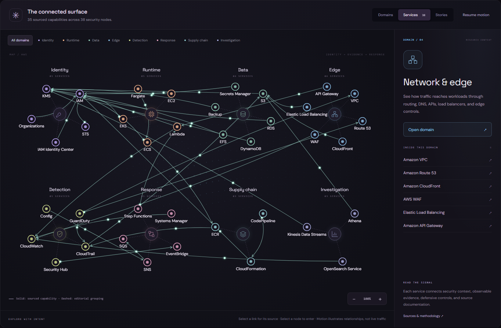

# TRACE

An interactive map of AWS services and their security controls. Follow a connection to its AWS documentation, check the evidence available for a service, or work through an incident scenario.

**[Open TRACE →](https://anonx00.github.io/trace/)**

[](https://anonx00.github.io/trace/)

## Explore

The map includes **40 services**, **41 documented relationships**, and **13 incident scenarios**.

- **Domains:** start with identity, workloads, data, networking, detection, response, supply chain, or investigation.
- **Services:** select a node for security notes, logs, controls, and documentation. Select a connection to see why it exists.
- **Stories:** step through a scenario and switch between threat context, evidence, and response.

Ctrl/Cmd+K opens search. **Reading view** puts the notes first; **Focus graph** gives the map more room. Saved services stay in your browser.

## Sources

AWS documentation supports the service relationships. Incident scenarios draw on MITRE ATT&CK, controlled AWS attack labs, AWS incident-response playbooks, and the research linked on the [Sources page](https://anonx00.github.io/trace/#/sources).

Capability links, scenario sequences, and navigation groupings have separate labels. TRACE describes possible relationships; it does not inspect your AWS account or show live incidents.

## Run it

Requires Node.js. There are no npm dependencies.

```sh
git clone https://github.com/anonx00/trace.git
cd trace
npm start
```

Open http://127.0.0.1:4173.

## Development

The frontend is plain JavaScript, CSS, and SVG. The background uses WebGPU where available, with a Canvas 2D fallback. Fonts are included in the repository.

<details>
<summary>Run the checks</summary>

Keep `npm start` running in another terminal.

```sh
python -m pip install -r requirements-dev.txt
python -m playwright install chromium
npm run check
python scripts/test_import_docs.py
npm run test:scenarios
npm run test:ui
npm run test:connections
npm run test:motion
npm run test:mind
```

</details>

<details>
<summary>Refresh the documentation index</summary>

```sh
python -m pip install -r requirements.txt
python scripts/import_docs.py --refresh
```

The importer saves headings, source URLs, short excerpts, and fetch dates in `generated/docs.json`. Downloaded HTML stays in `.cache/`. Review source changes before editing the security notes.

</details>

`npm run build` writes the site to `dist/`. [GitHub Actions](https://github.com/anonx00/trace/actions/workflows/pages.yml) checks pull requests and deploys successful pushes to `main`.

---

[anonx00](https://github.com/anonx00) · Not affiliated with AWS.
